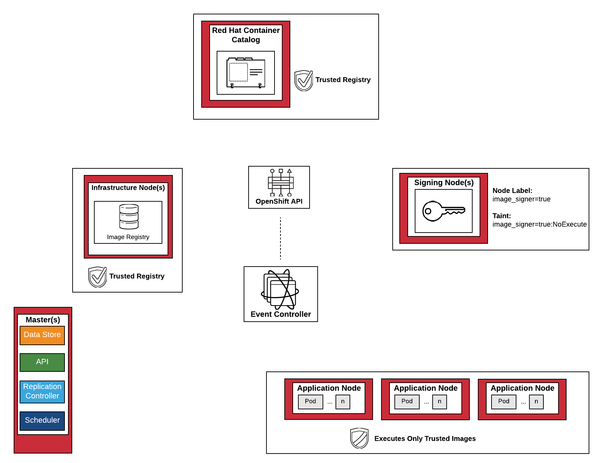

OpenShift Container Platform Image Signing and Image Scanning
========================================

_This repository is currently undergoing active development. Functionality may be in flux_

## Overview

The OpenShift Container Platform ecosystem contains mechanisms for securely managing container images. This includes but is not limited to [image signing](https://docs.openshift.com/container-platform/3.6/admin_guide/image_signatures.html) and [image scanning](https://docs.openshift.com/container-platform/3.6/security/container_content.html#security-content-scanning).

A set of Ansible tools is available to aid in the automation and configuration of the target environment.

## Image Signing

Image signing is a way to apply a digital signature to a container image. This guide describes how an automated process ca be created an implemented within OpenShift. The goal is to produce an environment that allows for only the execution of signed images from trusted sources (Red Hat Container Catalog [RHCC]) along with assets that are created within an organization or group.  

## Architecture



The signing architecture utilizes a typical OpenShift environment by specifying dedicated nodes for performing image signing actions. The key difference between image signing nodes and the rest of the nodes in the environment is relaxing the image requirement policies to allow for signing actions to occur on these nodes. 

Two ways to ensure only image signing workloads are scheduled onto these dedicated nodes is through [Node Selectors](https://docs.openshift.com/container-platform/latest/admin_guide/scheduling/node_selector.html#admin-guide-sched-selector-config) placed on image signing resources and [tainting](https://docs.openshift.com/container-platform/latest/admin_guide/scheduling/taints_tolerations.html) image signing nodes. Image signing resources, such as jobs, are configured with tolerations to allow execution on the tainted nodes.

The workflow for signing images can be seen below:


## Setup and Configuration

A set of Ansible playbooks and roles is available to automate the configuration of an environment to sign and allow exclusive access to only signed images. The following actions are performed in the automation tooling:

* Creation of GPG keys
* Configuration of OpenShift host machines to enable signature verification along with trusted sources
* Deployment of OpenShift cluster resources to host image signing resources

### Ansible Automation


#### Inventory File Configuration

The inventory file is broken down into 3 (three) host groups:

* gpg - Machine responsible for creating GPG keys
* image_signers - OpenShift nodes responsible for signing images
* nodes - All OpenShift nodes

#### Playbook Execution

The OpenShift environment can be configured by executing the `image-signing-setup.yml` playbook in the `ansible/playbooks` folder.

Execute the following command from within the _playbooks_ directory to initiate the setup:

```
ansible-playbook -i hosts image-signing-setup.yml
```

Once the playbook completes, the OpenShift environment will be configured to handle image signing and execution.

## Testing the Architecture

Login to the cluster and create a new project:

```
oc new-project project
```

Verifying a signed image requires additional permissions than what is created  for the default service. As part of the Ansible automation, a custom ClusterRole called `signature-viewer` was created with the necessary permissions. 

Execute the following command to add the cluster role to the service account:

```
oc adm policy add-cluster-role-to-user signature-viewer system:serviceaccount:<project>:default
```

Execute the build of the image. Once the build completes, a job can be created to sign the image as outlined in the subsequent section.

### Create a job to Sign an Image

Since the environment has been configured to only allow signed images to run, the image previously created in the prior section must be signed before it is allowed to run. 

A template was created in the `image-signer` project as part of the Ansible provisioning that will create a job to sign the image that is stored the OpenShift registry.

The template requires the following parameters:

|Template Parameter|Description|Default Value|
|--------------------------|----------------|-----------------|
|SERVICE_ACCOUNT_NAME|Name of the Service Account to use|imagemanager|
|NAMESPACE|Namespace in which to create the job|image-signer|
|IMAGE_TO_SIGN|Image location (Ex: _docker-registry.default.svc:5000/test-project/test-image:latest_)| |
|IMAGE_DIGEST|Image digest (Ex: sha256:43bf6f9ad59fe24e72bff8f2e7427639c034026d6ba43d37651d07812266e99a)| |
|SIGN_BY|Identity of the signer| |
|GPG_SECRET| Name of the secret containing the GPG keypair| gpg |
|NODE_SELECTOR_KEY| Node selector key | image_signer |
|NODE_SELECTOR_VALUE| Node selector value | true |

Instantiate the template

```
oc new-app -n image-signer --template=sign-image-template -p <params>
```

The image will be signed and pushed back to the OpenShift Registry where it can now be run within the cluster.

## Image Scanning

Coming soon